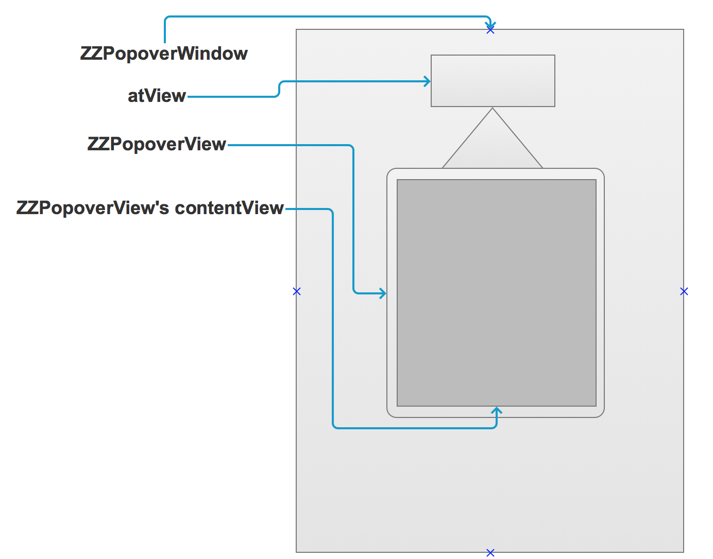

# ZZPopoverWindow
iOS pop视图的封装，支持有箭头和无箭头

1. 引入  
```
pod 'ZZPopoverWindow', '~> 1.0.1'
```

2. 代码  
```
- (IBAction)button1Click:(UIButton *)button {
    UIView *contentView             = [[UIView alloc] initWithFrame:CGRectMake(0, 0, 150, 200)];
    contentView.backgroundColor     = [UIColor redColor];
    // custom your contentView ...
    self.popover                    = [[ZZPopoverWindow alloc] init];
    // self.popover.popoverPosition = ZZPopoverPositionRight; // 指定contentView在箭头的哪个方向，默认自己会选择
    // self.popover.backgroundColor = [UIColor blackColor]; // 指定弹框背景色
    // self.popover.showArrow       = NO; // 是否显示箭头，默认YES
    // self.popover.margin          = 10.0; // 间隔
    self.popover.contentView        = contentView; // 指定contentView
    self.popover.didShowHandler = ^() {
        NSLog(@"Did show");
    };
    self.popover.didDismissHandler = ^() {
        NSLog(@"Did dismiss");
    };
    [self.popover showAtView:button];
}

```

效果图：  


原理图：


